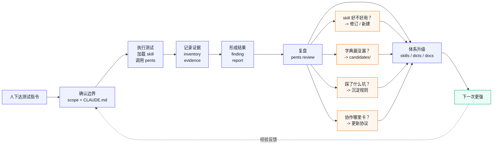

# Pentest Framework

一套让 AI 自主完成渗透测试并持续进化的体系。

[English](./README_en.md) | 中文

> 只用于授权安全测试。发布或贡献前请先阅读 [免责声明](./DISCLAIMER.md) 和 [安全策略](./SECURITY.md)。

<p align="center">
  
  
  
</p>

## 一句话

你对 Claude Code 说一句"测 `*.example.com`，别碰社交工程和 DoS，账号在 scope 里"，它自己完成信息收集、漏洞探测、证据登记、报告和复盘，并且每次测试后比上一次更聪明。

## 设计哲学

这个项目的起点是一个观察：**AI 已经能挖洞了，但缺少一个让它稳定、可积累、越来越强的运行环境。**

市面上渗透工具的设计对象是人——图形界面、功能菜单、手动配置。但 Claude Code 不需要这些。它需要的是：清晰的边界、结构化的记忆、可复用的武器、以及一个能把每次测试的经验沉淀下来反哺下一次的机制。

所以这个项目不是"又一个渗透工具"。它是一套为 AI 设计的**工作环境 + 进化闭环**。

### 三个核心信念

**信念一：人定边界，AI 执行。**

人不需要学会用某个渗透平台。人只需要说清楚：测什么、不能碰什么、有什么限制。剩下的事——选什么 skill、从哪个入口开始、怎么登记证据、什么时候该标记为阻塞等待授权——由 AI 在规则框架内自己判断。

`pents` CLI 不是给人手敲的，是给 Claude Code 调用的。人对 AI 说话，AI 调 CLI。人在这个系统里的角色是指挥官，不是操作员。

**信念二：每次测试必须让下一次更强。**

一次渗透测试做完，产出的不应该只是一份报告。它应该同时产出：

- 这个 skill 好用吗？哪里卡住了？有没有按新场景修订？
- 本次发现了什么默认字典没有的子域名、路径、参数？有没有进入候选词条池？
- 测试流程里有没有踩坑（比如 `dnsx -wd` 吞结果）？有没有沉淀成规则或文档？
- 子代理协议有没有暴露协作边界模糊的地方？需不需要更新任务卡模板？

这些东西如果不抓下来，下一次从零开始。抓下来了，AI 就会自己变强。这不是"用多了熟练"的玄学，是用结构化文件驱动的、可验证的进化。

**信念三：少即是多，文件即是数据库。**

大平台喜欢往项目里塞数据库、消息队列、Web 界面、权限系统。这套体系刻意不碰这些。

所有状态存在 Markdown 文件里。AI 读得懂，人也读得懂。没有数据库迁移，没有后台服务崩溃，不需要维护一套 Web 系统只为记录几个 finding。文件系统就是存储层，Git 就是版本历史，Markdown 就是数据格式。

这个决定不是偷懒。它意味着：项目可以随时打包迁移、AI 之间可以共享上下文、状态变更天然有 git diff 可追溯、而且你永远不会遇到"数据库挂了"这种问题。

## 体系的运作方式

### 人怎么用

你不会看到一长串 CLI 命令教程。你只对 Claude Code 说类似这样的话：

> 对 `*.example.test` 做信息收集。当前已授权 DNS 子域名枚举，还没拿到 HTTP 授权和测试账号。被动 recon 已经跑完了，五个来源全空，目标疑似在 CDN 后面。下一步做主动 DNS 字典枚举，字典用 `dicts/curated/subdomains-main.txt`，跑之前先做 canary 和泛解析检测。

或者：

> 上次的 OAuth skill 用起来有点卡，redirect_uri 绕过那部分在 Keycloak 场景下不够用。帮我修订一下 `skills/web/oauth-misconfiguration/SKILL.md`，补充 Keycloak 通配符 redirect 的检查步骤。

或者更简单：

> 复测 `projects/demo-e2e/`。这次拿到了脱敏测试账号，HTTP 低频探测已授权，速率上限每秒 5 请求。不要碰任务卡里列出的删除、支付或管理员写入接口。

AI 自己会去读 scope、调 `pents` 创建 run、加载 skill、登记证据、合并结果、写 report-delta。你只需要说清楚目标和边界。

### AI 怎么干活

这套体系的核心规则写在 [CLAUDE.md](CLAUDE.md) 里——Claude Code 打开项目后第一件事就是读取它。它告诉 AI：

1. 先读 scope，确认授权范围，永远不越界
2. 按标准流程推进：信息收集 → 漏洞探测 → 记录 → 报告 → 复盘
3. 用 `pents` CLI 做机械动作（创建项目、登记证据、合并输出、汇总报告），不手工拼 Markdown 表格
4. 不确定或证据不足时标记为阻塞，不硬往下走
5. 每轮执行后同步状态，让下一次接手时能直接续上

子代理协议也定义好了：主代理控边界、拆任务、审输出、写正式 finding；子代理只处理任务卡里的目标子集，返回结构化结果。`pents merge` 和 `pents review-agent-output` 负责把子代理的输出规范化地合并回项目记录。

### 进化闭环长什么样



这个闭环不是隐喻——每个环节都有对应的文件和脚本在驱动。`dicts/candidates/` 里真的会积累实战中发现的词条，`docs/项目路线/skill质量标准.md` 里真的有 skill 的评审标准，review.md 里真的记录了每个 skill 在实战中的表现。

除了测试反馈这条内循环，体系还有一条外循环：**情报输入。** `pentest-intel-hub/` 负责持续从外部安全情报中筛出高价值信息——漏洞公告、工具 release、高质量 writeup——经过评分、验证和结构化之后，输出成 skill 修订建议、字典候选、工具升级建议。它不是每次测试的产物，但同样是体系进化的燃料。测试告诉你哪里不够好，情报告诉你外面发生了什么新的。

## 目前能做什么

v0.1，已经在授权测试项目里做过端到端验证；公开仓库里的示例会尽量使用脱敏目标。

**已经跑通：**

- 完整的信息收集链路：被动 DNS（5 来源）→ JS 静态分析（路由/API/密钥/OAuth/支付线索提取）→ 软件指纹识别 → 主动 DNS 字典枚举（含 canary、泛解析检测、结果分类）
- 漏洞记录和报告：finding 模板 → evidence 证据链 → report 汇总（严重程度统计、证据缺口提示）
- 子代理协作：结构化子代理输出 → `pents merge` 合并 → `pents review-agent-output` 审查越界和证据不足
- 复测分层：`runs/R001`/`R002` 每轮独立，顶层只合并累计事实
- 首个实战反馈闭环：`dnsx -wd` 踩坑后修订了主动 DNS 枚举流程和 skill；被动来源不足的发现推动了 skill 补充更多数据源
- 情报蒸馏管线已就绪：`pentest-intel-hub/` 建立了从信息源分级 → 七维评分 → 知识卡片 → 验证 → 五类 export 输出到主项目的完整链路，等待持续投喂

**还在打磨：**

- HTTP/CDN 低频验证的执行回填
- run 结果合并和报告增量自动化
- 更多端到端实战验证

## 项目骨架

```
./
├── skills/           # 正式武器库 — 23 个中文 skill，按 recon/web/api 分类
│                     #   每个 skill 经过质量审查，实战反馈直接修订
├── templates/        # 项目模板 — scope/progress/inventory/evidence/finding/report/review/brief
│                     #   pents new 和 pents run new 用它们自动生成文件
├── projects/         # 渗透项目存档 — 每个项目一个目录，run 按 R001/R002 分层
├── dicts/            # 字典进化链路
│   ├── curated/      #   默认可用（子域名 16 万、路径、参数名）
│   └── candidates/   #   实战新发现 → 复盘后决定是否晋升
├── pentest-intel-hub/ # 情报蒸馏模块 — 从安全情报到知识卡片到候选建议的完整管线
│                     #   raw → normalized → scoring → knowledge card → validation → export → promoted
├── tools/            # 自写辅助脚本 — 可复用逻辑放这里，不在 CLI 里堆
├── cli/              # pents CLI — AI 的机械手，不做智能判断
├── docs/             # 项目文档 — 方向/路线/看板/决策记录/开发规范
├── refer/            # 原始参考资料 — Xalgorix 源码 + fuzzDicts 字典库，不进版本库
├── CLAUDE.md         # AI 工作规则 — 每个 Claude Code 会话第一件读的东西
└── AGENTS.md         # 人类开发者规则 — 项目自己的 AI 开发约束
```

## 关于 `pents` CLI

再说一次：`pents` 的 UI 不是命令行。它的 UI 是你对 Claude Code 说的自然语言。

`pents` 是 AI 手里的工具，负责那些需要确定性、可复现、不能靠模型临场发挥的机械操作：

- `new` — 创建项目目录和模板，不会少文件或多空格
- `active-dns` — 生成受控主动 DNS 计划，带 canary、泛解析检查和耗时记录
- `vision-review` — 把截图交给视觉模型复核，输出结构化 JSON
- `evidence` — 登记证据并自动算 SHA256，不会忘字段
- `merge` — 把子代理的结构化 JSON 输出解析合并到 inventory/progress，不会漏行
- `report` — 汇总 finding 生成报告草稿，严重程度统计和证据缺口检查是确定性的
- `doctor-recon` — 检查 subfinder/dnsx/httpx 等工具的安装状态，缺什么说什么
- `suggest-skills` — 根据测试面匹配 skill，覆盖人话到 skill 路径的映射

这些事如果让 AI 手工做，每次都要在 prompt 里强调"别忘了算 SHA256""记得检查证据链完整性"。用 CLI 做，一次写对，永远对。

## 关于 AI 引擎

有人看到满篇的"Claude Code"，会以为这套体系绑定了 Anthropic 的平台。实际上没有。

整个架构对 AI 引擎的依赖只有一层：**有一个能读文件、调命令、按规则做判断的 agent。** 具体是哪个 agent，不重要。

- `CLAUDE.md` 是一份 Markdown 规则文件。换个 agent 叫别的名字——`AGENTS.md`、`CODEX.md`、`system.md`——规则一样生效。
- `pents` 是标准 Python CLI。任何能调 shell 的 agent 都能用它。
- skill 是 Markdown 文件。换个 agent 换种加载方式，内容不需重写。
- 模板、字典、项目记录全部是 Markdown 和 JSON。通用格式，不绑定任何平台。

当前用 Claude Code 是因为它在这套体系里跑得最好——长上下文、子代理调度、skill 系统和工具调用这几个维度上目前没有更好的选择。但架构上没有锁死任何东西。**明天换成 Codex、Hermes 或任何下一代 agent，需要改的只有入口文件命名和 skill 的加载方式，体系本身不用重来。**

## 和一些东西的区别

**和 Burp Suite / OWASP ZAP 的区别：** 不做流量拦截，不做自动爬虫，不是代理。这个体系管的是"怎么测、怎么记、怎么进化"，实际测试时你仍然用 Burp 和 httpx 和 sqlmap——`pents doctor-recon` 就是确认这些家伙装没装好。

**和 Xalgorix 的关系：** Xalgorix 是一个带 Web 界面的渗透测试平台，这个项目保留了它的原始资料作为素材库（`refer/xalgorix/`），但刻意不继承它的 Web UI、数据库和架构。取的是它的 skill 思路，用更轻的方式落地——文件代替数据库，AI 代替界面。

**和一般 AI 渗透脚本的区别：** 不是"一个 prompt 打天下"。这套体系有记忆（项目文件）、有武器（skill）、有反馈（review → 修订）、有积累（candidates → curated）。单次测试可能差不多，五次之后差距拉开。

## 边界和约束

这是刻意设的，不是还没做：

- 不用数据库。文件就是状态。Markdown 就是格式。
- 不做 Web 界面。AI 不需要按钮。
- 不自研 agent loop。Claude Code 已经在跑 agent，不需要再造一个。
- `pents` 不做智能判断。它是 AI 的手，不是 AI 的大脑。
- 不在授权范围外执行任何请求。scope 永远是第一道检查。
- 不把 300+ 原始 skill 全量搬运。只做 Web/API MVP，用完一个修订一个。
- 弱口令、RCE、SQL、XSS 等 payload 字典默认不启用——必须专项授权。

## 参与贡献

欢迎提 issue 和 PR，但请先看 [CONTRIBUTING.md](./CONTRIBUTING.md)：不要提交真实目标数据、密钥、截图、HAR 或未脱敏报告。

## License

MIT
