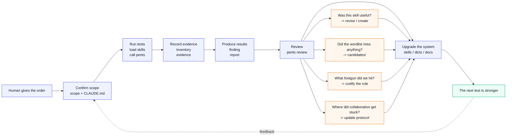

# Pentest Framework

A system where AI runs penetration tests autonomously and gets better after every engagement.

English | [中文](./README.md)

> For authorized security testing only. Please read the [Disclaimer](./DISCLAIMER.md) and [Security Policy](./SECURITY.md) before publishing, contributing, or using this project in an engagement.

<p align="center">
  
  
  
</p>

## In one line

You tell Claude Code "test `*.example.com`, no social engineering, no DoS, credentials are in the scope file." It handles recon, vulnerability discovery, evidence tracking, reporting, and post-engagement review — and after each test, the system is measurably smarter than before.

## Design philosophy

This started from a simple observation: **AI can already find vulnerabilities. What it lacks is an environment that makes it stable, cumulative, and progressively more capable.**

Every pentesting tool on the market was designed for humans — GUIs, feature menus, manual configuration dialogs. Claude Code doesn't need any of that. What it needs is: clear boundaries, structured memory, reusable weapons, and a mechanism that captures everything learned in one engagement and feeds it into the next.

So this isn't "yet another pentesting tool." It's a **runtime environment + evolutionary loop** built for AI.

### Three core beliefs

**Belief one: Humans set boundaries. AI executes.**

Nobody should need to learn a pentesting platform to get value from this. You describe what to test, what not to touch, and what constraints apply. Everything else — which skill to load, which entry point to start from, how to register evidence, when to stop and flag something as blocked pending authorization — the AI decides within the rule framework.

`pents` CLI is not meant for human fingertips. It's a tool Claude Code calls. The human speaks; the AI invokes the CLI. Your role in this system is commander, not operator.

**Belief two: Every test must make the next one stronger.**

A penetration test should not end with a PDF report. It should also produce:

- Was this skill effective? Where did it break? Does it need revision for a new scenario?
- Did we find subdomains, paths, or parameters missing from the default wordlists? Did they enter the candidate pool?
- Did we hit a footgun (like `dnsx -wd` silently eating all results)? Has it been captured as a rule or documented pitfall?
- Did the sub-agent protocol expose blurry collaboration boundaries? Does the task card template need updating?

If you don't capture these, you start from zero next time. If you do, the AI evolves. Not in the vague "it gets better with practice" sense — this is structured, file-driven, verifiable evolution.

**Belief three: Less is more. Files are the database.**

Big platforms love stuffing projects with databases, message queues, web dashboards, and permission systems. This framework deliberately avoids all of that.

All state lives in Markdown files. AI can read them. Humans can read them. There's no database to migrate, no backend service to crash, no web system to maintain just to track a handful of findings. The filesystem is the storage layer, Git is the version history, Markdown is the data format.

This isn't laziness. It means: projects can be packed up and moved anywhere, context is natively shareable between AI sessions, every state change has a `git diff`, and you will never deal with a corrupted database.

## How the system works

### The human experience

You won't find a wall of CLI tutorials here. You talk to Claude Code in natural language:

> Run recon against `*.example.test`. DNS enumeration is authorized. HTTP probing and test accounts are not yet approved. Passive recon is done — five sources, all empty. Target appears to be behind a CDN. Next step: active DNS dictionary enumeration with `dicts/curated/subdomains-main.txt`. Run canary and wildcard detection first.

Or:

> The OAuth skill was awkward last time — the redirect_uri bypass section doesn't cover Keycloak well. Revise `skills/web/oauth-misconfiguration/SKILL.md` to add Keycloak wildcard redirect checks.

Or even simpler:

> Retest `projects/demo-e2e/`. A sanitized test account is available. Low-frequency HTTP probing is authorized, max 5 req/s. Do not touch deletion, payment, or privileged write endpoints listed in the task card.

The AI reads the scope, calls `pents` to scaffold a run, loads the right skills, registers evidence, merges results, and writes the report delta. You just define the objective and the boundaries.

### How the AI operates

The operating rules live in [CLAUDE.md](CLAUDE.md) — it's the first thing Claude Code reads when entering the project. It tells the AI:

1. Read scope first. Confirm authorization boundaries. Never cross them.
2. Follow the standard workflow: recon → discovery → recording → reporting → review
3. Use `pents` CLI for deterministic operations (scaffolding, evidence registration, sub-agent merge, report generation) — don't hand-craft Markdown tables
4. When uncertain or lacking evidence, mark as blocked — don't push forward blindly
5. Sync state after every session so the next one can pick up immediately

Sub-agent protocols are defined too: the main agent owns scope, task decomposition, output review, and official findings. Sub-agents handle their assigned surface and return structured output. `pents merge` and `pents review-agent-output` normalize and merge everything back into the project records.

### The evolutionary loop



This loop isn't figurative. Every link corresponds to actual files and scripts in the repo. `dicts/candidates/` genuinely accumulates entries discovered in real engagements. `docs/项目路线/skill质量标准.md` contains actual review criteria for skills. `review.md` records the real-world performance of every skill used.

## What it can do right now

v0.1, already validated through authorized end-to-end test projects; public examples are kept sanitized where possible.

**Working:**

- Full recon pipeline: passive DNS (5 sources) → JS static analysis (routes, API endpoints, secrets, OAuth/payment clues) → software fingerprinting → active DNS dictionary enumeration with canary verification, wildcard detection, and result classification
- Finding lifecycle: template → evidence chain with SHA256 → report aggregation (severity stats, evidence gap flags)
- Sub-agent collaboration: structured sub-agent output → `pents merge` → `pents review-agent-output` (scope creep detection, evidence sufficiency check, dedup)
- Retest isolation: `runs/R001`/`R002` each self-contained, only accumulated facts merge upward
- First feedback loop in action: the `dnsx -wd` incident led to revised active DNS procedures and skill updates; thin passive source coverage drove skill improvements
- **Intel distillation pipeline**: `pentest-intel-hub/` — a full pipeline from source grading → 7-dimension scoring → knowledge cards → validation → export suggestions into 5 output channels, ready for intel intake

**Still rough:**

- Low-frequency HTTP/CDN validation and result backfill
- Run result merging and report-delta automation
- More real-world validation miles

## The skeleton

```
./
├── skills/           # 23 curated Chinese skills: recon/web/api
│                     #   Each reviewed for quality. Revised from field feedback.
├── templates/        # Project templates — pents new uses them to scaffold
├── projects/         # Engagement archives — one dir per project, runs in R001/R002 layers
├── dicts/            # Wordlist evolution pipeline
│   ├── curated/      #   Default-ready: 167k subdomains, paths, params
│   └── candidates/   #   Field discoveries → promoted after review
├── pentest-intel-hub/ # Intel distillation — raw intel → scoring → knowledge cards → validation → export suggestions
├── tools/            # Custom scripts — reusable logic, kept out of the CLI
├── cli/              # pents CLI — the AI's mechanical hand, no intelligence of its own
├── docs/             # Project docs: direction, roadmap, kanban, decisions
├── refer/            # Reference material — Xalgorix source + fuzzDicts, not tracked in Git
├── CLAUDE.md         # AI work rules — the first file every Claude Code session reads
└── AGENTS.md         # Human dev rules — AI contribution constraints for the project itself
```

## About the `pents` CLI

Once more: the CLI's UI is not the command line. Its UI is natural language directed at Claude Code.

`pents` is the AI's tool — it handles deterministic, reproducible operations where a language model shouldn't improvise:

- `new` — scaffolds a project directory and templates. Never misses a file or mangles whitespace.
- `active-dns` — generates controlled active DNS plans with canary, wildcard checks, and timing.
- `vision-review` — sends screenshots to a vision model and returns structured JSON.
- `evidence` — registers evidence with automatic SHA256 hashing. Never forgets a field.
- `merge` — parses structured sub-agent JSON and merges it into inventory/progress. Never drops a row.
- `report` — aggregates findings into a report draft. Severity stats and evidence gap detection are deterministic.
- `doctor-recon` — checks installed recon tools. Reports exactly what's missing.
- `suggest-skills` — maps natural language queries to skill paths. Bridges human descriptions to the skill catalog.

If the AI had to do these by hand, every session would burn tokens reminding itself "don't forget to hash the evidence file" or "make sure the Markdown table columns are aligned." Do it once in Python, it's right forever.

## How this differs

**vs. Burp Suite / OWASP ZAP:** This isn't an intercepting proxy or a crawler. It governs *how* you test, *how* you record, and *how* you evolve. You'll still use Burp and httpx and sqlmap during actual testing — `pents doctor-recon` confirms they're installed.

**vs. Xalgorix:** Xalgorix was a pentesting platform with a web UI and database. This project keeps its raw materials as reference (`refer/xalgorix/`) but deliberately drops the UI, the database, and the architecture. It takes the skill concept and reimagines it lighter: files instead of a database, AI instead of an interface.

**vs. generic AI pentesting scripts:** This isn't "one clever prompt to rule them all." This system has memory (project files), weapons (curated skills), feedback (review → revision), and accumulation (candidates → curated). One-off tests might look similar. After five engagements, the gap becomes obvious.

## Boundaries (on purpose, not pending)

- No database. Files are state. Markdown is the format.
- No web UI. AI doesn't need buttons.
- No custom agent loop. Claude Code already runs agents — no need to reinvent it.
- `pents` makes zero intelligent decisions. It's the AI's hand, not its brain.
- Nothing executes outside authorized scope. Ever. Scope is always the first gate.
- Not bulk-porting 300+ raw skills. Web/API MVP only. Use one, revise one.
- Weak password, RCE, SQL, and XSS payload wordlists are not enabled by default — they require explicit authorization.

## Contributing

Issues and pull requests are welcome. Please read [CONTRIBUTING.md](./CONTRIBUTING.md) first: do not submit real target data, secrets, screenshots, HAR files, or unsanitized engagement reports.

## License

MIT
